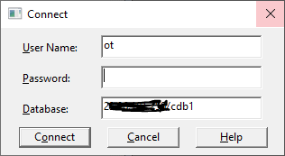

# Oracle Modernization Proof-of-Concept

Oracle Modernization is a proof-of-concept to allow users to perform CRUD operations on an Oracle Database.

## Install Oracle on Azure

Follow [this tutorial](https://docs.microsoft.com/en-us/azure/virtual-machines/workloads/oracle/oracle-database-quick-create#code-try-1)

> When restarting the VM, ip will change and nic might need to be [reconfigured](https://docs.microsoft.com/en-us/azure/virtual-machines/troubleshooting/reset-network-interface)
> If you still can't connect to the VM enable the oracle listener `$ sudo -su oracle` && `lsnrctl start` and set the SID `ORACLE_SID=cdb1; export ORACLE_SID`

Connect to the database using sql developer and create the [oracle-sample-database](https://www.oracletutorial.com/getting-started/oracle-sample-database/)

Fix the form builder here:
https://devio.wordpress.com/2010/09/22/forms_builder_classpath-not-set-after-installation-of-oracle-forms-builder-11-1-1-2-0/

## Configure Justin Data Starter

Copy `src\backend\libs\justin-data-starter\src\main\resources\hibernate.properties.template` to `src\backend\libs\justin-data-starter\src\main\resources\hibernate.properties`

Edit the following properties:

```config
hibernate.dialect=org.hibernate.dialect.OracleDialect
hibernate.default_schema=OT
hibernate.connection.driver_class=oracle.jdbc.driver.OracleDriver
hibernate.connection.url=jdbc:oracle:thin:@<yourip>:1521:cdb1
hibernate.connection.username=ot
hibernate.connection.password=<yourpassword>
```

## Install Oracle Form Builder

Prerequisites:

- Java jdk 8
- Visual C++ [install](https://www.microsoft.com/en-us/download/details.aspx?id=40784)

Follow these [instructions](https://oracle-base.com/articles/12c/standalone-forms-builder-12c-installation-on-windows-1221)

Open `<your installation dir>\Middleware\forms_builder\forms\templates\registry\formsbuilder.reg` and look for the following entry:

```
[HKEY_LOCAL_MACHINE\%ORACLE_HOME_REG_KEY%]
"FORMS_BUILDER_CLASSPATH"="%ORACLE_HOME%\\..."
```

Create a new entry in the windows registry under `HKEY_LOCAL_MACHINE\SOFTWARE\Oracle\KEY_OracleHome1`

**Value name**: FORMS_BUILDER_CLASSPATH
**Value data**: The value from the formsbuilder.reg, for me it was: `%ORACLE_HOME%\\jlib\\frmbld.jar;%ORACLE_HOME%\\jlib\\importer.jar;%ORACLE_HOME%\\jlib\\debugger.jar;%ORACLE_HOME%\\jlib\\utj.jar;%ORACLE_HOME%\\oracle_common\\jlib\\ewt3.jar;%ORACLE_HOME%\\oracle_common\\modules\\oracle.bali.share\\share.jar;%ORACLE_HOME%\\jlib\\dfc.jar;%ORACLE_HOME%\\oracle_common\\modules\\oracle.help\\ohj.jar;%ORACLE_HOME%\\oracle_common\\modules\\oracle.help\\help-share.jar;%ORACLE_HOME%\\oracle_common\\modules\\oracle.help\\oracle_ice.jar;%ORACLE_HOME%\\oracle_common\\modules\\oracle.bali.jewt\\jewt4.jar;%ORACLE_HOME%\\forms\\java\\frmwebutil.jar;%ORACLE_HOME%\\forms\\java\\frmall.jar;%ORACLE_HOME%\\forms\\java\\frmwebsocketjsi.jar`

Then execute `<your installation dir>\Middleware\Oracle_Home\bin\frmbld.exe`

To connect to the database go to file > Connect... and enter the database credentials:



> Do not specifiy the PORT in the connection string (this can cost lots of time)

Install [jdeveloper-12c](https://www.oracle.com/tools/downloads/jdev-v12120-downloads.html) and choose the 32bit version as they are mixed up ;-)
